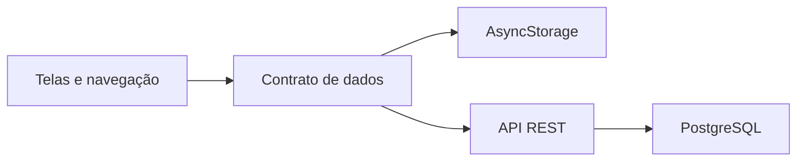

<div align="center">

# Validade Fácil

### Controle de validade, lotes e estoque na palma da mão

Aplicativo multiplataforma para pequenos comércios acompanharem produtos, anteciparem vencimentos e reduzirem perdas operacionais.

[](https://reactnative.dev/)
[](https://expo.dev/)
[](https://www.typescriptlang.org/)
[](https://github.com/wellissonreis/validade-facil-api)

[Visão do produto](#visão-do-produto) • [Arquitetura](#arquitetura) • [Executar](#execução-local) • [Integração](#integração-com-a-api)

</div>

## Sobre o projeto

O **Validade Fácil** nasceu de um problema real: pequenos mercados, padarias e comércios perdem dinheiro porque o acompanhamento de validades ainda depende de planilhas, anotações ou conferências manuais.

O aplicativo centraliza o controle de produtos e lotes, facilita registros por código de barras e transforma movimentações de estoque em informações úteis para a operação. Este repositório contém o cliente mobile; autenticação, persistência e regras transacionais ficam na [API oficial](https://github.com/wellissonreis/validade-facil-api).

## Visão do produto

| Área | Recursos |
| --- | --- |
| **Dashboard** | Indicadores de produtos vencidos, próximos do vencimento e com estoque baixo |
| **Produtos** | Cadastro, busca, edição, imagem e leitura de código de barras |
| **Lotes** | Quantidade, identificação e data de validade por lote |
| **Estoque** | Entradas, saídas, ajustes, descartes e baixa de vencidos |
| **Rastreabilidade** | Histórico de movimentações e comparação entre entradas e saídas |
| **Operação** | Modo local ou conexão autenticada com uma instalação própria da API |

## Arquitetura

A interface é organizada por funcionalidades e consome uma abstração única de dados. Isso mantém telas e fluxos independentes do modo de persistência utilizado.



```text
src/
├── app/                 # composição das rotas
├── features/            # módulos funcionais e telas
├── navigation/          # contratos e fluxos de navegação
├── shared/api/          # cliente HTTP, autenticação e sessão
├── shared/config/       # configuração por ambiente
├── shared/storage/      # contratos e implementações de persistência
└── assets/              # identidade visual e recursos estáticos
```

### Modos de dados

- **`storage`** — persiste dados localmente com AsyncStorage; útil para desenvolvimento e uso sem servidor.
- **`onpremise`** — conecta o aplicativo à API REST e centraliza autenticação, catálogo, lotes e movimentações no PostgreSQL.

## Stack

- React Native 0.85 e React 19
- Expo SDK 56
- TypeScript 6
- React Navigation
- AsyncStorage
- Expo Camera e Expo Image Picker

## Execução local

### Pré-requisitos

- Node.js compatível com o Expo SDK 56
- npm
- Android Studio, Xcode ou dispositivo compatível com o ambiente Expo

### 1. Instale e configure

```bash
git clone https://github.com/wellissonreis/validate-facil.git
cd validate-facil
npm install
cp .env.example .env
```

### 2. Escolha o modo de dados

Operação local:

```env
EXPO_PUBLIC_APP_DATA_MODE=storage
```

Conexão com a API:

```env
EXPO_PUBLIC_APP_DATA_MODE=onpremise
EXPO_PUBLIC_API_URL=http://localhost:8080
```

> No emulador Android, utilize `http://10.0.2.2:8080` para acessar a API executada na máquina host.

### 3. Inicie o aplicativo

```bash
npm run start
```

| Comando | Finalidade |
| --- | --- |
| `npm run android` | Executa o projeto Android |
| `npm run ios` | Executa o projeto iOS |
| `npm run web` | Inicia a versão web |
| `npm run typecheck` | Valida os tipos TypeScript |
| `npm run lint` | Executa a análise estática |

## Integração com a API

No modo `onpremise`, o aplicativo autentica o usuário, mantém sua sessão e delega à API as operações de catálogo, lotes e estoque.

Para executar a solução completa:

1. configure e inicie a [Validade Fácil API](https://github.com/wellissonreis/validade-facil-api);
2. confirme que `GET /health` está respondendo;
3. informe a URL alcançável pelo dispositivo em `EXPO_PUBLIC_API_URL`;
4. inicie o aplicativo no modo `onpremise`.

O contrato de endpoints, filtros, exemplos e respostas está em [docs/api.md](https://github.com/wellissonreis/validade-facil-api/blob/main/docs/api.md).

## Qualidade e evolução

Antes de publicar alterações:

```bash
npm run typecheck
npm run lint
```

Novas funcionalidades devem preservar a separação entre componentes visuais, regras de fluxo e acesso a dados. Configurações específicas de ambiente e informações sensíveis devem permanecer fora do controle de versão.

## Repositórios do produto

- **Mobile:** [wellissonreis/validate-facil](https://github.com/wellissonreis/validate-facil)
- **API:** [wellissonreis/validade-facil-api](https://github.com/wellissonreis/validade-facil-api)

## Licença

Consulte o arquivo [LICENSE](LICENSE) para os termos de uso e distribuição.
